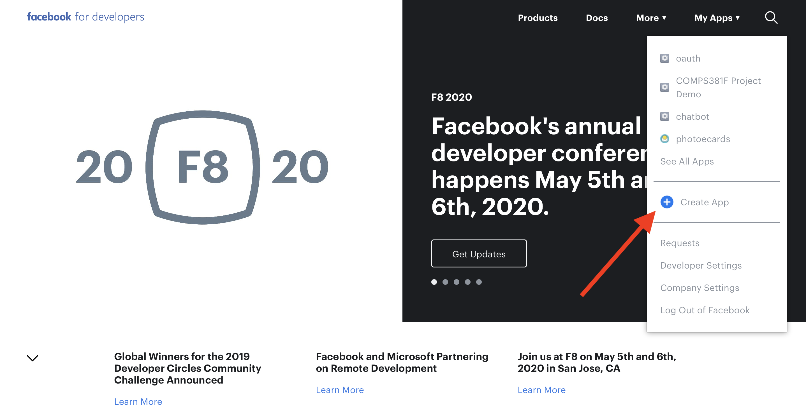
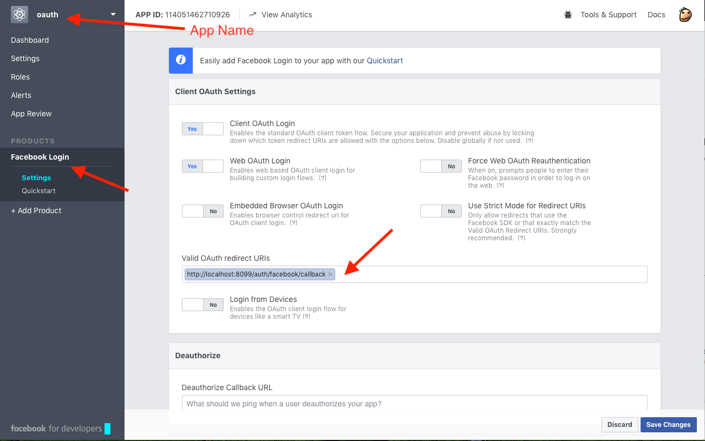
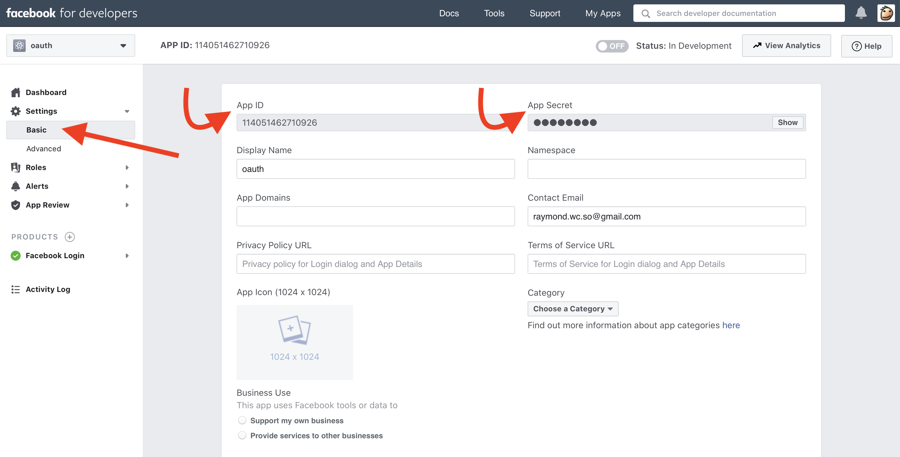

# COMPS381F - Passport, OAuth Middleware for Node.js [Reference]

1. Create a Facebook App at [developer.facebook.com](https://developer.facebook.com/apps) to obtain an **App ID** and **App Secret**



2. Configure your newly created Facebook App.  Use the URL below as **Valid OAuth redirect URIs**

   ```
   http://localhost:8099/auth/facebook/callback
   ```



3. Put your App ID and App Secret into the `facebookAuth` variable



   ```
   var facebookAuth = {
      'clientID'        : '', // facebook App ID
      'clientSecret'    : '', // facebook App Secret
      'callbackURL'     : 'http://localhost:8099/auth/facebook/callback' 
   };
   ```

**Remember to update `callbackURL` if you deploy your server to the cloud!**

Documentation of Passport can be found [here](http://www.passportjs.org).
